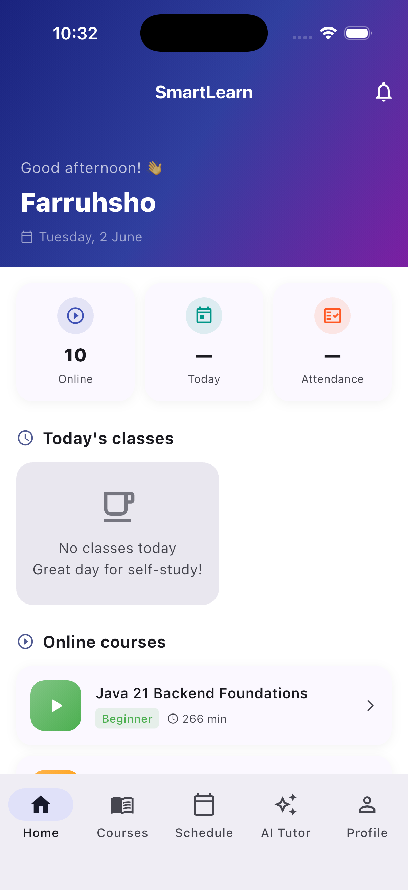
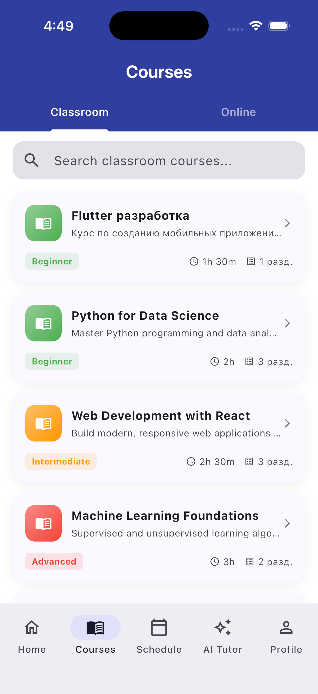
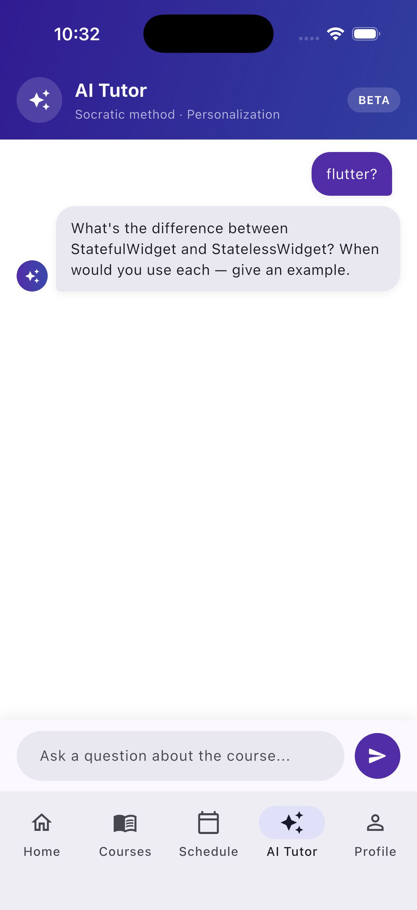
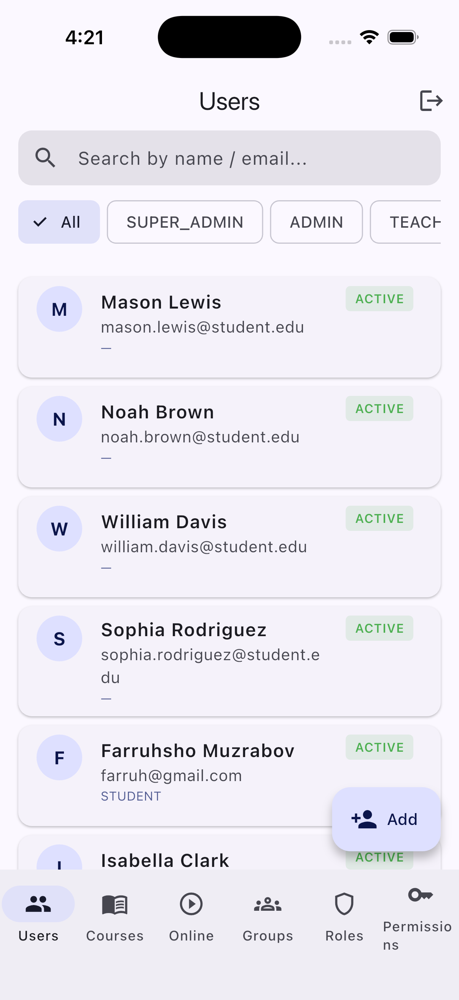
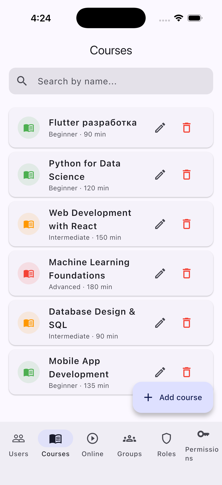
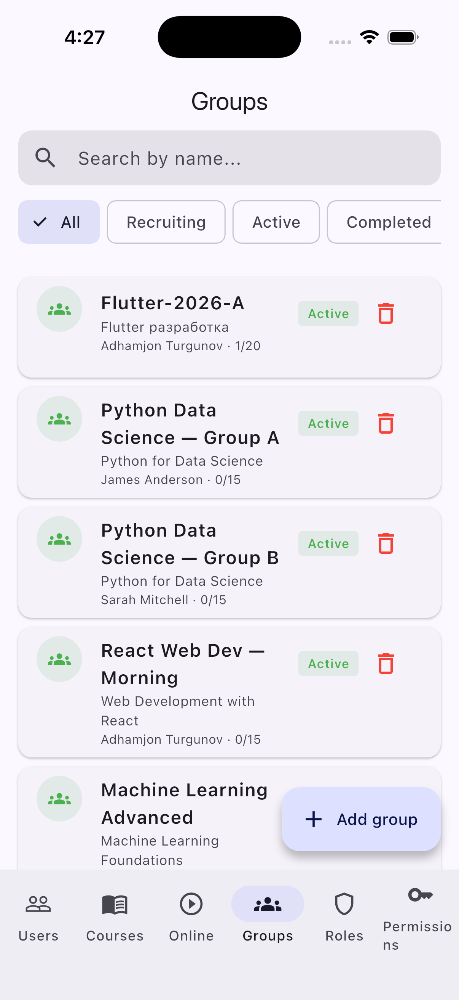

<div align="center">

# SmartLearn

### Cross-Platform Learning Management System

<p align="center">
  
</p>


</div>

---

## 📖 Overview

**SmartLearn** is a cross-platform Learning Management System (LMS) built as a graduation thesis project — with an **AI tutor at its core**. A single **Flutter** codebase (mobile, desktop, web) is paired with a **Java Spring Boot** REST backend.

Its flagship feature is the **AI study assistant**: a personalized, Socratic-method tutor that answers course questions and guides learners step by step — a smart alternative to traditional self-study. Around it, SmartLearn covers the full educational workflow: courses and online courses, groups and schedules, attendance, homework and submissions, and resumable file uploads — all under a role and permission model (Admin, Teacher, Student, Parent).

---

## ✨ Key Features

- **🤖 AI study assistant (flagship)** — a personalized, Socratic-method AI tutor that answers course questions and guides learners — a smart alternative to traditional self-study
- **Role-based access control** — Admin, Teacher, Student and Parent profiles with granular permissions
- **Course management** — offline courses, sections, lessons, and self-paced online courses with progress tracking
- **Groups & scheduling** — group creation, lesson sessions, and recurring schedules
- **Attendance tracking** — marking and reviewing attendance per session
- **Homework** — assignments, submissions, and attachments
- **File handling** — resumable (TUS) uploads with MinIO object storage
- **Authentication & security** — JWT-based auth, rate limiting, and a configurable security layer
- **Internationalization** — English, Russian and Uzbek (en / ru / uz)
- **Real-time** — WebSocket (STOMP/SockJS) support for live updates
- **API documentation** — interactive Swagger UI via SpringDoc OpenAPI

---

## 📸 Screenshots

**Student app**

<p align="center">
  
  
  
</p>

**Admin panel**

<p align="center">
  
  
  
</p>

---

## 🏗 Architecture

A monorepo split into two independent applications plus project documentation:

```
SMARTLEARNN/
├── code/
│   ├── flutter/      # Flutter client (Android, iOS, Web, macOS, Windows)
│   └── backend/      # Spring Boot REST API (LMS server)
└── docs/             # Thesis, presentation and supporting documents
```

The Flutter client follows a **feature-first Clean Architecture** (data / domain / presentation layers) with dependency injection, a typed HTTP client and code-generated models. The backend is a layered **Spring Boot** service (controller → service → repository) with MapStruct DTO mappers, JPA specifications for filtering, and a modular security configuration.

---

## 🧰 Tech Stack

### 📱 Frontend — Flutter


Riverpod · get_it / injectable · freezed · Dio · go_router · secure storage

### 🖥 Backend — Spring Boot


Spring Boot 4 · Spring Security + JWT (jjwt) · Spring Data JPA / Hibernate · PostgreSQL · MinIO object storage · TUS resumable uploads · MapStruct + Lombok · Caffeine cache · SpringDoc OpenAPI (Swagger) · WebSocket (STOMP/SockJS) · Maven

### ⚙️ DevOps & Tools


---

## 🚀 Getting Started

### Prerequisites

- Flutter SDK (stable channel) and Dart
- JDK 21
- Docker & Docker Compose (recommended for the backend stack: app, PostgreSQL, MinIO)

### Frontend — Flutter client

```bash
cd code/flutter
flutter pub get
flutter run
```

### Backend — Spring Boot API

The API runs on port **8888**. Swagger UI: `http://localhost:8888/swagger-ui/index.html`

```bash
cd code/backend

# Option A — full stack with Docker (app + PostgreSQL + MinIO)
docker compose up -d --build

# Option B — run the app with Maven (needs PostgreSQL & MinIO running)
./mvnw spring-boot:run
```

> Copy `code/backend/.env.example` to `.env` and fill in the values (PostgreSQL, JWT secret, MinIO credentials) before running.

---

## 📑 Documentation

The `docs/` folder contains the full thesis and supporting materials:

| File | Description |
|------|-------------|
| Diploma_Work_SmartLearn.docx / .pdf | Graduation thesis (Word & PDF) |
| Presentation_SmartLearn.pptx | Defense presentation |
| Application_Kurbanov_A.pdf | Application document |

---

## 👥 Authors & Supervision

| Role | Person |
|------|--------|
| Author — Flutter client (mobile / desktop / web) & project lead | **Azimjon Kurbanov** ([@aziimjon](https://github.com/aziimjon)) |
| Backend — Spring Boot LMS API (collaboration) | **Abdurahmon Mirmaxsudov** ([@mirmaxsudov](https://github.com/mirmaxsudov)) |
| Academic supervisor | [@andreybond](https://github.com/andreybond) |
| Academic supervisor | [@Jelena1975](https://github.com/Jelena1975) |

---

## 🔗 Connect

[](https://t.me/azimjon_kurbanov)
[](https://instagram.com/azimjon_kurbanov)
[](https://wa.me/996999731999)
[](mailto:azimjon.kurbalovv@gmail.com)

---

<div align="center">

*Developed as a graduation thesis project · Riga Nordic University*


</div>
